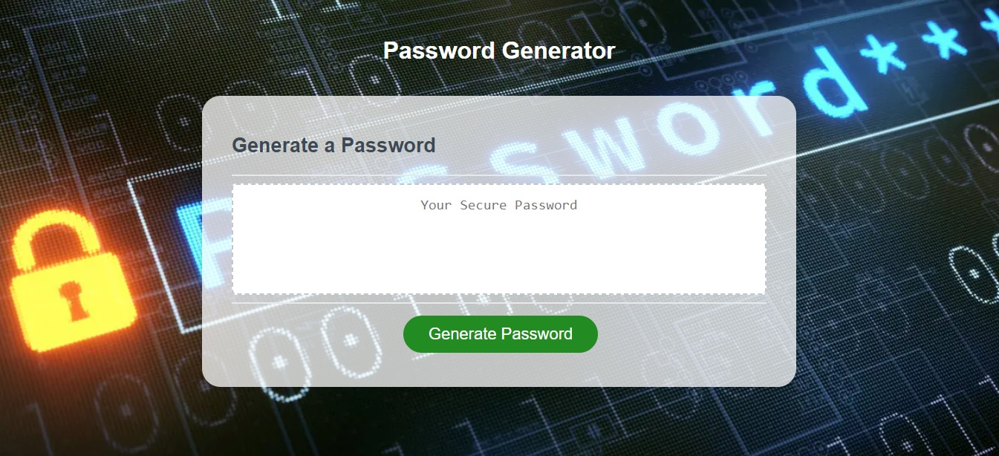

# Password-Generator

## Description
The Password Generator application enables users to generate random passwords based on criteria that they’ve selected. 

## Purpose
The Password Generator application runs in a browser and features dynamically updated HTML and CSS powered by JavaScript code. It has a clean and polished, responsive user interface that adapts to multiple screen sizes.

## Installation
To install my project use the following link: https://github.com/dianavw8/Password-Generator and follow these simple directions:

Above the list of files, click on the "Code" button.

Copy the URL for the repository.

Open Git Bash.

Change the current working directory to the location where you want the cloned directory.

Type git clone, and then paste the URL you copied earlier.

Press Enter to create your local clone.

For more help and information achiving this, check out the following website: https://docs.github.com/en/repositories/creating-and-managing-repositories/cloning-a-repository

## Usage
The refactored website can be found at: https://dianavw8.github.io/Password-Generator/

The following image demonstrates the web application's appearance and functionality:

## Lessons Learned
The Password Generator project has shown me the importance of pseudo coding and planning to help the flow of the coding process. This code had a lot of details necessary to the function of the generator that could have been missed if not for proper planning.

## Credits and Inspiration
https://github.com/dianavw8

https://coding-boot-camp.github.io/full-stack/github/professional-readme-guide

https://docs.github.com/en/repositories/creating-and-managing-repositories/cloning-a-repository